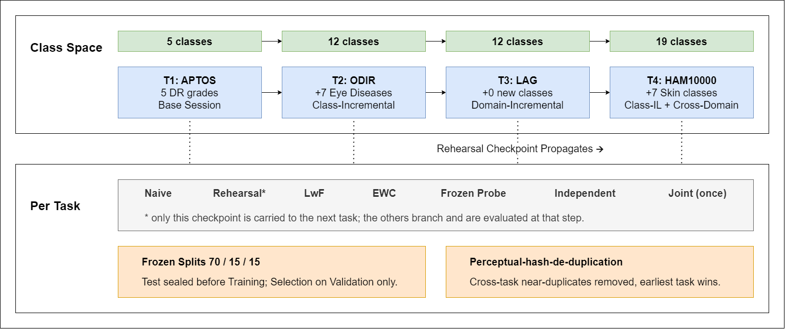

<div align="center">

# STARL

### A Leakage-free Benchmark for Continual Learning in Medical Imaging
**What is forgotten, where, and at what clinical cost**

[](LICENSE)
[](https://creativecommons.org/licenses/by/4.0/)
[](https://www.python.org/)
[](https://doi.org/PLACEHOLDER_ZENODO_DOI)
[](PLACEHOLDER_MEDIA_URL)

</div>



---

## Overview

Continual learning promises diagnostic models that acquire new conditions without retraining — but reported retention figures are hard to trust when the same images recur across tasks. **STARL** is a continual-learning benchmark for medical imaging built so the numbers can be believed: image-level disjointness is enforced by perceptual hashing **before any model is fitted**, and each task's test partition is frozen and quarantined from training, replay, and model selection.

Four tasks are learned in sequence — diabetic-retinopathy grading, seven further retinal conditions, a glaucoma set acquired from a different source, and dermoscopic lesions — growing a single classifier head **from 5 to 19 classes with no task identity at test time**. Twelve architectures are compared under six strategies with lower/upper reference bounds and three seeds, plus external validation on two never-seen collections.

## Why STARL

- **Leakage-free by construction.** A single perceptual-hash index removes near-duplicates across *and* within tasks (2,099 images removed) before training; test partitions are frozen at construction and never read by any training loop, buffer, or checkpoint rule.
- **Two regimes, reported separately.** Class-incremental (new diseases) and domain-incremental (same diseases, new source) are never averaged together.
- **Clinically grounded evaluation.** Per-class recall on minority grades, a ranking-aware metric suite, and external validation on independent collections.
- **Fully reproducible.** Frozen split manifests, the de-duplication report, the unified class index, all analysis code, and all result tables are released so the benchmark can be reproduced *exactly* rather than approximately.

## Key results

| Strategy | Mean final accuracy | | Headline finding |
|---|:--:|---|---|
| Naive fine-tuning | 0.20 | | Replay beats naive fine-tuning in **14/14** paired runs |
| Learning without Forgetting | 0.21 | | Replay recovers **89%** of the joint (offline) ceiling |
| Elastic Weight Consolidation | 0.20 | | LwF and EWC give **no measurable** benefit |
| **Rehearsal (replay)** | **0.70** | | 20 exemplars/class ≈ a buffer **3× larger** (92–103%) |
| Joint (upper bound) | 0.80 | | 1 exemplar/class recovers **~two-thirds** of replay's gain |

- **Interference is governed by task *similarity*, not the number of new classes.** Adding 7 retinal conditions to a retinal model leaves **0.30** of the preceding task; adding 7 dermoscopic categories leaves **0.87**. Reordering the sequence changes forgetting in the predicted direction.
- **Forgetting is a deep-feature displacement, not a biased classifier.** A post-hoc classifier correction recovers none of the loss; representation-similarity analysis locates the damage in the deepest, most task-specific features.
- **Forgetting concentrates in the rarest, most clinically urgent grades** (severe and proliferative retinopathy), which aggregate accuracy hides.
- **External failure is dataset shift, not continual learning** — roughly 8× as much of the drop is attributable to the shift between collections.

*(All figures are reproduced from the paper; see `docs/REPRODUCE.md` and the deposited result tables.)*

## The benchmark

| Task | Dataset | Modality | Classes | Regime | Retained (train / val / test) |
|:--:|---|---|:--:|---|---|
| T1 | APTOS 2019 | Colour fundus | 5 | Base session | 2,869 (2,008 / 430 / 431) |
| T2 | ODIR-5K | Colour fundus | 7 | Class-incremental | 3,807 (2,664 / 571 / 572) |
| T3 | LAG | Colour fundus | 0 (2 recur) | Domain-incremental | 4,231 (2,961 / 635 / 635) |
| T4 | HAM10000 | Dermoscopy | 7 | Class-IL + cross-domain | 9,794 (6,855 / 1,469 / 1,470) |
| Ext-1 | Messidor-2 | Colour fundus | 5 (DR) | External test only | 1,744 |
| Ext-2 | Derm7pt | Dermoscopy | subset of T4 | External test only | 987 |

19 unified classes, 20,701 retained images after de-duplication. Per-class counts are in the paper's Supplementary Table S2. **The image datasets are third-party and are not redistributed here** — see [Data availability](#data-availability).

## Repository structure

```
STARL/
├── README.md
├── LICENSE                      # MIT (code)
├── CITATION.cff
├── requirements.txt
├── .gitignore
├── starl/                       # core library + pipeline
│   ├── starl_core.py            # datasets, models, metrics, training loop
│   ├── preprocess_and_split.py  # de-duplication + frozen 70/15/15 manifests (Phase 1)
│   ├── runners/                 # per-task training entry points (APTOS, ODIR, LAG, HAM)
│   ├── strategies/              # baselines, LwF/EWC, rehearsal, KD, bias-correction, joint, external
│   └── analysis/                # CKA, significance, aggregation, per-image predictions, split counts
├── manifests/                   # split_manifest_*.csv, unified_classes.json, dedup_report.csv
├── results/                     # per-run metrics + result tables
├── figures/                     # figures used here and in the paper
└── docs/
    └── REPRODUCE.md             # step-by-step reproduction guide
```

> **Note on layout.** The `runners/`, `strategies/`, and `analysis/` grouping is a tidy home for the existing scripts (`T1_APTOS_runner.py`, `STARL_kd.py`, `STARL_cka.py`, …). They share one import — `starl_core` — so if you move them into subfolders, either add an `__init__.py` and import as `from starl.starl_core import …`, or keep the scripts flat under `starl/` to change nothing. `manifests/` and `results/` can hold the files directly or a short `README` pointing at the Zenodo record.

## Getting started

```bash
git clone https://github.com/<your-username>/STARL.git
cd STARL
python -m venv .venv && source .venv/bin/activate   # Windows: .venv\Scripts\activate
pip install -r requirements.txt
```

**Reproduce the benchmark** (full guide in `docs/REPRODUCE.md`):

1. Obtain the four datasets from their original providers (links below) and point the paths in `starl/preprocess_and_split.py`.
2. Build the frozen, de-duplicated splits: `python starl/preprocess_and_split.py` → writes `manifests/` (`split_manifest_*.csv`, `unified_classes.json`, `dedup_report.csv`). *(Or skip training the splits and use the deposited manifests directly — every downstream script reads images through them, so no image can leak across train/val/test or across tasks.)*
3. Train and evaluate under each strategy via the `runners/` entry points; aggregate with the `analysis/` scripts to regenerate the result tables and figures.

## Data availability

All four constituent datasets are third-party resources and are **not redistributed here**:

- **APTOS 2019** — [Kaggle](https://www.kaggle.com/competitions/aptos2019-blindness-detection)
- **ODIR-5K** — [Peking University ODIR-2019](https://odir2019.grand-challenge.org/)
- **LAG** — obtained directly from the authors of Li et al. (2019); not ours to release
- **HAM10000** — [Harvard Dataverse / ISIC](https://doi.org/10.7910/DVN/DBW86T)
- **Messidor-2** — images from [ADCIS](https://www.adcis.net/en/third-party/messidor2/); adjudicated grades from Krause et al. (2018)
- **Derm7pt** — [derm.cs.sfu.ca](https://derm.cs.sfu.ca/)

To make the benchmark reproducible without redistributing images, the **split manifests, de-duplication report, unified class index, analysis code, and result tables** are deposited on Zenodo: **DOI `PLACEHOLDER_ZENODO_DOI`**.

## Citation

If you use STARL, please cite the paper and the archived release:

```bibtex
@article{ahsan2026starl,
  title   = {STARL: A Leakage-free Benchmark for Continual Learning in Medical Imaging},
  author  = {Ahsan, Rayeed Aabir and Islam, Rejmin and Mohsin, Jarif and Ahmed, Silvia},
  journal = {Medical Image Analysis},
  year    = {PLACEHOLDER_YEAR},
  doi     = {PLACEHOLDER_MEDIA_DOI}
}

@software{starl_repo,
  title     = {STARL: A Leakage-free Benchmark for Continual Learning in Medical Imaging},
  author    = {Ahsan, Rayeed Aabir and Islam, Rejmin and Mohsin, Jarif and Ahmed, Silvia},
  year      = {2026},
  publisher = {Zenodo},
  doi       = {(https://doi.org/10.5281/zenodo.22905549)}
}
```

## License

- **Code** — [MIT](LICENSE).
- **Deposited data** (split manifests, de-duplication report, class index, result tables) — [CC BY 4.0](https://creativecommons.org/licenses/by/4.0/).
- The image datasets remain under their original providers' licenses and terms.
